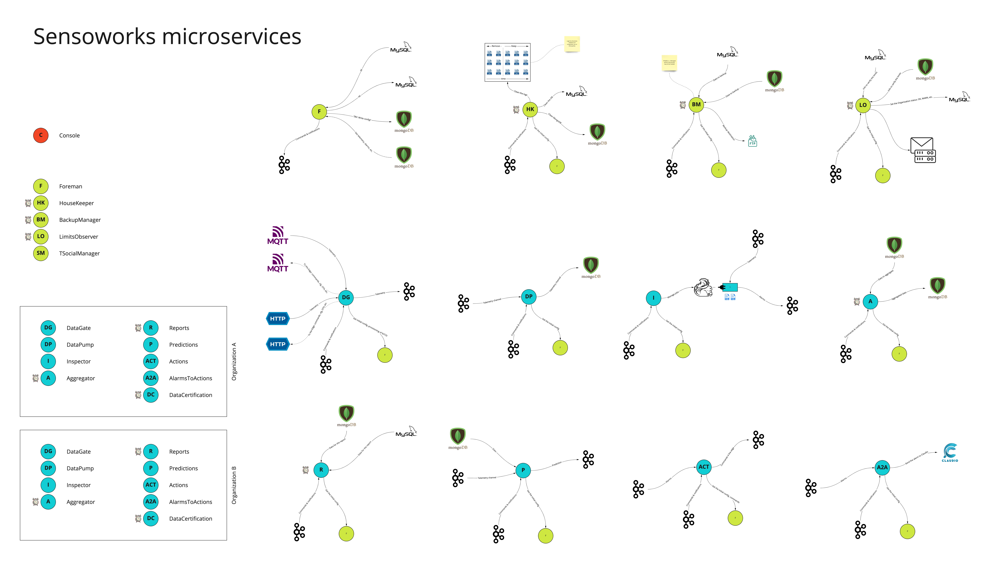

# Components

The microservices of the Sensoworks platform are shown here:

Let's now analyze the function of each individual component in detail.

## DataGate

The DataGate manages the authentication and authorization of devices connected to the platform. It supports HTTP/S and/or MQTT/S protocols for bidirectional communication with devices (sensors or actuators). The DataGate supports multi-protocol communication and serves as the platform's boundary component. Incoming data is normalized by this component to match the format used within the platform. The DataGate also handles automatic (self-provisioning of connected devices) or manual provisioning, which can be configured by the user. Incoming traffic can be disabled at the level of a single connected device or groups of devices, for example entire things or networks.

## DataPump

The DataPump is responsible for storing telemetry data from devices and/or systems connected to the platform. Its architecture supports a wide range of stores and streaming systems, including MongoDB, Cassandra, relational databases, Hadoop and many others. This versatile and flexible micro-service plays a crucial role in the overall functioning of the platform, ensuring that all relevant data is collected, stored, and made accessible as needed. Whether you need to store vast amounts of data for big data analysis or to simply keep track of a few key metrics, the DataPump has you covered. With its ability to seamlessly integrate with a wide range of stores, it provides a centralized and streamlined solution for data storage needs.

## Foreman

Designed with an "API first" approach for use in headless environments, this central component enables the platform to retrieve data from third-party systems via HTTP/REST. It also provides third-party systems with access to processed or raw data (telemetry data) acquired from connected devices. It also centralizes the auditing for the entire platform, where any operation performed on devices, things, or networks (D/T/N) is recorded and maintained in the platform's historical records.

This highly secure and robust API gateway provides a critical link between the platform and the various systems it interacts with. It enables the platform to seamlessly and efficiently retrieve the data it needs to operate, while also providing third-party systems with access to the data they need to perform their own operations. Whether you need to monitor device performance, track network activity, or retrieve data for analysis, the Foreman provides a reliable and secure solution that is specifically designed to meet the demands of headless environments. Its advanced auditing features further ensure the security and integrity of your data, providing a complete and comprehensive solution for all your data acquisition and retrieval needs.

## Aggregator

The purpose of this component is to aggregate data stored in various storage systems where sensor readings are kept. The aggregation logic can be set on a schedule, for example, once a day, week, or can be customized as pleased, and aggregates time series data based on user-defined rules. The time of aggregation of the data (minute, hour, etc.) and the type of aggregation performed on the collected data can also be defined by the user. For aggregations of scalar sensor values with physical significance (temperatures, inclinations, fill levels, humidity levels, etc.), typical of structural and/or environmental monitoring, the minimum, maximum, and average values of the readings are calculated by default. Other aggregation logic must be set for different types of data. For instance, in the case of data counting the number of elements detected by sensors, the aggregation would simply be the sum of the elements within the aggregation range, typical in assembly line scenarios.

## AlarmsInspector

## Executor

The Executor is responsible for managing the actions that can be performed on the actuators connected to the IoT platform. Whether the actuator managed by the platform is a door that needs to be opened or closed, or a temperature controller that needs to be adjusted accordingly, or any other object, the commands that can be sent to specific objects are handled by the Executor. For new actuators that are configured, the platform's administration console will allow for defining which interactions can be performed on the connected objects.

## Inspector2Executor

## Reporter

## Predictor

## Certificator

## SocialManager

The responsibility of this component is to deliver informative messages to users of the IoT platform through various channels such as email, SMS, Slack, Facebook, Twitter, and others. This component can be configured by the platform users (super admin, tenant admin, operators, etc.) to meet the requirements of the IoT project. Given that we live in a highly social era, it is crucial for a modern IoT platform to consider this aspect as a core feature.

## BackupManager

The Backup Service is responsible for backing up the data of the IoT platform, which is stored in the relational database MySQL and the document-based database MongoDB. The component allows the scheduling of backups (e.g. daily, weekly, or monthly) and the customization of what data to save and where to save it, such as saving a database dump on a remote server via FTP or other means.

## HouseKeeper

The Housekeeper Service plays a critical role in maintaining the platform's databases in an organized and clean state. This includes databases such as MySQL, Mongo, and any data lakes (such as Hadoop and others), system logs, and any other storage that "consumes" space within the system. The main responsibility of Housekeeper is to apply data removal logic, primarily related to sensor data. For example, the system can be configured to remove data older than a week, month, or year. These cleaning logics can be customized based on the Tenant, Networks, and devices involved, for all the archives concerned.

The Housekeeper Service ensures that the platform's databases remain clean, efficient, and secure at all times. Its ability to apply customizable data removal logic means that organizations can easily configure the platform to meet their specific data retention needs, whether it be to comply with regulations, conserve storage space, or maintain performance. This highly flexible and efficient service is an essential component of the platform, providing organizations with the tools they need to ensure their data is always kept organized, secure, and ready for use.

## LimitObserver

The Usage Limiter Observer component is responsible for monitoring the usage limits of the Sensoworks service when used in a SaaS version with restrictions on platform API calls, or agreements on the maximum storage space dedicated to data storage, or mixed logic. It ensures that usage stays within the agreed-upon limits and prevents over-consumption of resources.

The Usage Limiter Observer component enables the efficient use of the Sensoworks service and helps ensure that customers receive the full benefits of their investment.
