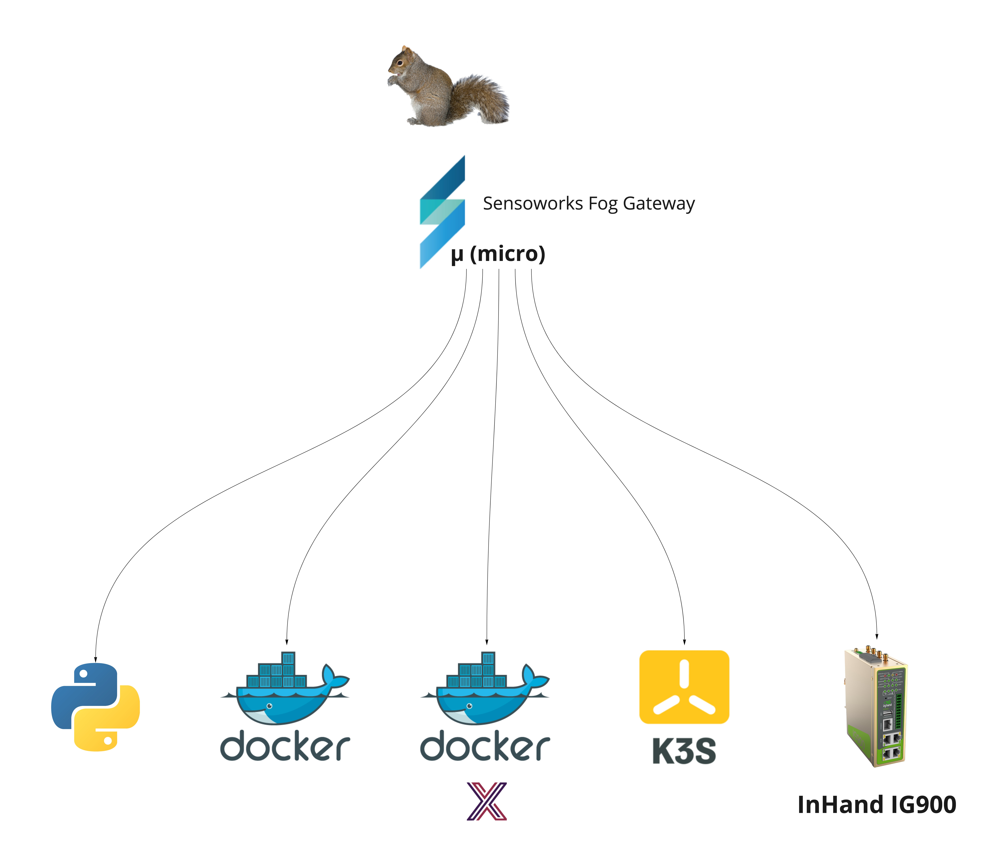

# Fog installation on-premise

The Sensoworks Fog gateway is an excellent choice for flexibility and versatility. While it does require a computer capable of running Python, this requirement is typically not an issue due to the Sensoworks Fog gateway's intended use compared to the C and C++ versions of fhe Sensoworks Edge gateways. In fact, even small computers like Raspberry Pi can be configured to run the Fog component. Overall, the Sensoworks Fog gateway's flexibility and adaptability make it a suitable option for a wide range of applications.

Depending on your needs, the Sensoworks Fog gateway (a.k.a. "micro" or "squirrel") can be installed in different ways:

<p align="center"></p>

## Pure python

Pre-requisites:

- Python has to be installed into your system. If not, follow the instuctions from the main Python website: [python.org](https://www.python.org/)
- Install pip (the package installer for Python) following the instructions from [pip.pypa.io](https://pip.pypa.io/en/stable/)
- Install git following the instructions from [git-scm.com](https://git-scm.com/)
  - **NOTE**: If you don't want to install git, you can also download and unzip the pre-packaded release of fhe Sensoworks Fog gateway. See here: [Fog gateway releases](https://github.com/sensoworks/sensoworks-fog-gateway/releases)

Optional:

- Install an MQTT provider like [mosquitto.org](https://mosquitto.org/) if not already available somewhere else. Alternatively, for testing purposes, you can use the testing environment of mosquitto online: [test.mosquitto.org](https://test.mosquitto.org/)

Once the pre-requirements are met, follow these instructions:

```sh
# Move into the parent directory where you want to install the Sensoworks Fog gateway
cd <parent directory where you want to install the Sensoworks Fog gateway>

# Download the Sensoworks Fog gateway
git clone https://github.com/sensoworks/sensoworks-fog-gateway.git

# NOTE: Alternatively you can manually download the release from here: https://github.com/sensoworks/sensoworks-fog-gateway/releases and after that, unzip it

# Move into the Sensoworks Fog gateway home
cd sensoworks-fog-gateway

# Install the requirements
pip install -r requirements.txt
```

✅ DONE :-)

Now you are ready to run the Sensoworks Fog gateway.

The Sensoworks Fog gateway comes pre-packaged with a simple demo service, that monitors a simulated sensor. Follow this [**getting started guide**](../fog-getting-started-guide.md).

## Dockerized standalone (TBF)

Pre-requisites:

- Docker has to be installed on your system. If not, follow the instuctions from the main Docker website [docker.com](https://www.docker.com/)
- Install Docker compose. If not already installed, follow the instuctions from the main Docker compose website [docker compose](https://docs.docker.com/compose/)

Once **Docker** anche **Docker Compose** are installed, follow these instructions:

Without mqtt embedded:

```sh
docker run --name sensoworks-fog-gateway sensoworks-fog-gateway:latest
```

With mqtt embedded:

```sh
# Move into the directory you want to install the Sensoworks Fog gateway
# cd <the parent directory where you want to install the Sensoworks Fog gateway>

# Download the Sensoworks Fog gateway
git clone https://github.com/sensoworks/sensoworks-fog-gateway.git

# Note: Alternatively you can manually download the release from here: https://github.com/sensoworks/sensoworks-fog-gateway/releases and after that, unzip it

# Move into the Sensoworks Fog gateway home
cd sensoworks-fog-gateway

# Move into the docker compose directory
cd docker

# Run the Docker container
docker-compose -d up
```

✅ DONE :-)

Now you are ready to run the Sensoworks Fog gateway.

## Dockerized with EdgeX

TBD

## Dockerized with the Industrial Appliance

TBD
