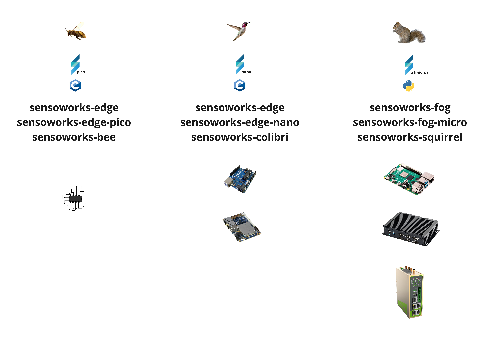

Among of various possibilities to use a Sensoworks edge component:

<p align="center"></p>

When it comes on flexibility, the Fog gateway, is certainly a good choice. Of course it requires a computer capable of running Python, but since it is meant for other uses respect to the other versions of the Edge gateways (C and C++) this is in general not a problem. For example also small computers such as Raspberry can be configured to run the Fog component.

Depending on your needs, the Fog gateway ("micro" or "squirrel") can be installed in different ways:

<p align="center"></p>

# Pure python

Pre-requisites

- Python has to be installed into your system. If not, follow the instuctions from the main Python website: [python.org](https://www.python.org/)
- Install pip (the package installer for Python) following the instructions from [pip.pypa.io](https://pip.pypa.io/en/stable/)
- Install git following the instructions from [git-scm.com](https://git-scm.com/)
  - **NOTE**: If you don't want to install git, you can also download and unzip the pre-packaded release of the Fog Gateway. See here: [Fog gateway releases](https://github.com/sensoworks/sensoworks-fog-gateway/releases)

Optional:

- Install an MQTT provider like [mosquitto.org](https://mosquitto.org/) if not already available somewhere else. Alternatively, for testing purposes, you can use the testing environment of mosquitto online: https://test.mosquitto.org/

Once Python is installed, follow these instructions:

```console
# Move into the parent directory where you want to install the Fog gateway
cd <parent directory where you want to install the Fog gateway>

# Download the fog gateway
git clone https://github.com/sensoworks/sensoworks-fog-gateway.git

# NOTE: Alternatively you can manually download the release from here: https://github.com/sensoworks/sensoworks-fog-gateway/releases and after that, unzip it

# Move into the fog gateway home
cd sensoworks-fog-gateway

# Install the requirements
pip install -r requirements.txt
```

DONE :-)

Now you are ready to run the Senworks Fog gateway.

The Sensoworks comes pre-packaged with a simple demo service, that monitors a simulated sensor. Follow this [ **getting started guide**](#getting-started-guide).

# Dockerized standalone

Pre-requisites:

- Docker has to be installed on your system. If not, follow the instuctions from the main Docker website [docker.com](https://www.docker.com/)
- Install Docker compose. If not already installed, follow the instuctions from the main Docker compose website [docker compose](https://docs.docker.com/compose/)

Once **Docker** anche **Docker Compose** are installed, follow these instructions:

Without mqtt embedded:

```console
#!/bin/bash

docker run --name sensoworks-fog-gateway sensoworks-fog-gateway:latest
```

With mqtt embedded:

```console
#!/bin/bash

# Move into the directory you want to install the fog gateway
# cd <the parent directory where you want to install the Fog gateway>

# Download the fog gateway
git clone https://github.com/sensoworks/sensoworks-fog-gateway.git

# Note: Alternatively you can manually download the release from here: https://github.com/sensoworks/sensoworks-fog-gateway/releases and after that, unzip it

# Move into the fog gateway home
cd sensoworks-fog-gateway

# Move into the docker compose directory
cd docker

# Run the Docker container
docker-compose -d up
```

DONE :-)

Now you are ready to run the Senworks Fog gateway.

The Sensoworks comes pre-packaged with a simple demo service, that monitors a simulated sensor. Follow this [ **getting started guide**](#getting-started-guide).

# Dockerized with EdgeX

TBD

# Dockerized with the Industrial Appliance

TBD

# Getting started guide

This small guide is meant to be show, with a basic example, how the Sensoworks Fog gateway works and how to configure it. The scenario that will be implemented is shown here:

<p align="center"></p>

The simulator will send temperature data into a MQTT topic named

Pre-requisites (in addition to Python)

- Install an MQTT client browser, such as for example [MQTT X](https://mqttx.app/)

```console
# Start Mosquitto or verify that it is already running
mosquitto

# Edit the config file of fhe simulator
cd getting_started_guide

# If you are not using mosquitto on port 1883, edit the config file of fhe simulator to change it
# Set the parameters of the signal you want to simulate
vi sensoworks_fog_simulator.json

# Edit the config file of fhe fog gateway
```
