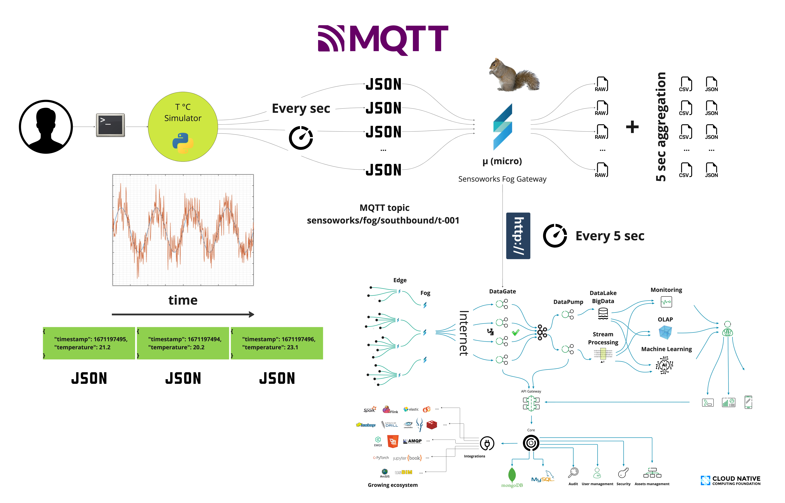
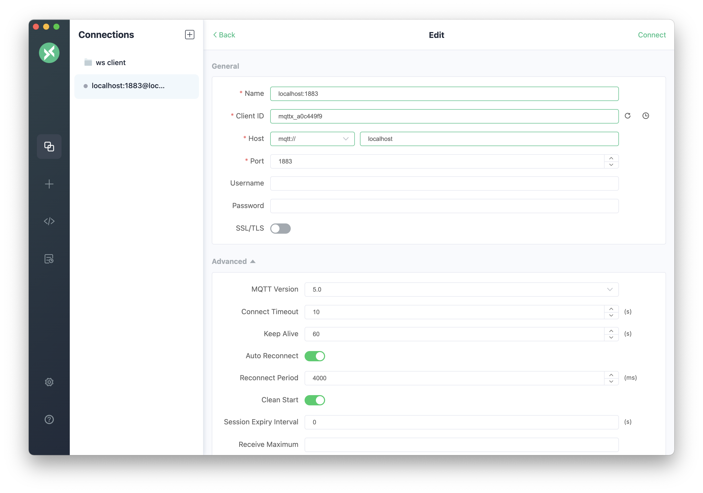

# Fog: getting started guide - Intro

This guide is intended to provide a simple example of the functionalities and configuration of the Sensoworks Fog gateway. The scenario presented in this guide is depicted below:

<p align="center"></p>

The simulator, on the upper left of the picture, will send temperature data to a MQTT topic named:

- sensoworks/fog/southbound/t-001

{: .note }

> **NOTE**: By default the simulator will send data every second, but this value can be changed, among other parameters, in the configuration file of the simulator.

The Sensoworks Fog gateway will then perform these steps:

- Read the incoming messages from MQTT
- Write the raw messages to disk
- Elaborate and aggregate the incoming messages. The aggregation period is set for this getting started guide to 5 seconds, but it can be changed in the configuration file
- Prepare the Sensoworks payload to call the platform
- Save the aggregated data in CSV and JSON format to file
- Call the Sensoworks platform via HTTP
  - **NOTE**: This step is initially set to "disabled" and the output is printed to stdout. To connect the Fog gateway to the platform you need an api key to communicate using the HTTP protocol (see below additional details)

# Getting started guide - Steps

{: .warning }

> **WARNING**: If you have not installed the Fog gateway yet, please install it following the instructions here: [**Edge installation**](./edge-installation.md).
> This guide has been prepared for a local installation of the **Pure Python** version of the Fog gateway.
> If you installed other versions of the gateway, the procedure may be slightly different.

## Pre-requisites

{: .note }

> **NOTE**: Depending on which version of the Sensoworks Fog component you installed, some requirement may already be met.

- Install an MQTT client browser, such as for example [MQTT X](https://mqttx.app/)
  - **NOTE**: This app is needed only if you want to directly monitor the MQTT server

## Start Mosquitto

{: .note }

> **NOTE**: If you already have an MQTT server running somewhere else, you can just skip this step.

```sh
# Verify if the MQTT server is running
ps -ef | grep mosquitto

# Run mosquitto, if not already running
mosquitto
```

## Run the MQTT client browser

{: .note }

> **NOTE**: This step is only necessary if you wish to directly monitor the MQTT server. If this is not a requirement for your use case, this step can be safely omitted.

The MQTT browser should be installed into your system. Use the OS application menu to launch the program.

<p align="center"></p>

## Edit the config file of fhe simulator

```sh
# Move into the getting started directory
cd simulators/getting_started_guide

# Install the requirements (mqtt + numpy)
pip install -r requirements.txt

# Change, if you like, the parameters of the MQTT server and the parameters of the signal to generate
vi sensoworks_signal_simulator.json

# Verify that the configuration works fine
python sensoworks_signal_simulator.py -c sensoworks_signal_simulator.json

# Use Control^C to stop it
```

The expected output should be something like this:

```json
{"timestamp": 1671388853, "temperature": 2.0}
{"timestamp": 1671388854, "temperature": 2.7}
{"timestamp": 1671388855, "temperature": 2.8}
{"timestamp": 1671388856, "temperature": 3.5}
{"timestamp": 1671388857, "temperature": 3.7}
{"timestamp": 1671388858, "temperature": 4.8}
```

Now you are ready to start the sensoworks_fog_gateway.py

## Edit the config file of fhe Fog gateway

The Getting Started guide includes a pre-configured file for the Fog Gateway that processes temperature data from the MQTT topic, performs data aggregation and analysis, and outputs the results to files and sends them to the Sensoworks platform (this step is "disable" at the beginning because it requires a token from the plaftform).

```sh
# Move back to the root directory of the Fog gateway
cd ../..

# Configure the Fog gateway
vi ./config/sensoworks_fog_gateway_getting_started_guide.json
```

> **NOTE**: By default the communication to the platform step is set to "disabled" and the output is printed to stdout. To connect the Fog gateway to the platform you need an api key. This steps are not included in this guide. If you already have an account and configured a Network to receive the data from the Edge, locate and modify this section of the configuration file.

```json
{
  ...
    ...
      ...
        "senders": [
            {
                "header": {
                    "id": "src.northbound.senders.http_sender",
                    "class": "HTTPSender",
                    "description": "Sends data to a HTTP endpoint",
                    "input": "src.core.aggregators.standard_aggregator",
                    "mandatory_tbf": true,
                    "enabled": false
                },
                "parameters": {
                    "endpoint": "https://tenant-a-uat.sensoworks.com/datagate/sensoworks/datagate?network=<CHANGE_THIS_WITH_YOUR_NETWORK_ID>",
                    "api_key": "<CHANGE_THIS_WITH_THE_API_KEY>"
                }
            }
        ]
        ...
      ...
    ...
  ...
}

                    "module_path": "src.northbound.senders.http_sender",
                    "id": "Sender_OLIVIERI_A",
                    "class": "HTTPSender",

## Start the Sensoworks Fog gateway

```sh
## Move into the home directory of the Fog gateway
cd ..

# Run the Fog gateway
python sensoworks_fog_gateway.py --config ./config/sensoworks_fog_gateway_getting_started_guide.json
```

## MQTT topic subscription

{: .note }

> **NOTE**: This step is optional: Open the MQTT X application to register to "sensoworks/#" to see Sensoworks messaged being processed.

## Check out the output files produced by the Fog gateway

By default the configuration for getting started guide produces:

```sh
# Move into the home directory of the Fog gateway
cd logs

# Check the raw data. Control^C to stop it
tail -f TBD

# Check the output files (json and csv). Control^C to stop it
tail -f TBD

# Check the Fog logs. Control^C to stop it
tail -f TBD
```

## Open the Sensoworks Desk Console

> **NOTE**: To see the data on the platform you need to have previously configured the api key to communicate to the platform. It means that you need to be registered to the platform, that a Network was created an a Datagate HTTP configured.

[https://demo.sensoworks.com/console](https://demo.sensoworks.com/console)

---

JSON configuration file for the signal simulator:

```json
{
    "broker_host": "localhost",
    "broker_port": 1883,
    "topic": "sensoworks/fog/southbound/t-001",
    "username": "",
    "password": "",

    "_comment_0": "Parameters to generate a sinusoidal signal + a random.",
    "_comment_1": "f(t) = amplitute * sin((2 * pi / period_in_seconds)(t - phase_shift)) + vertical_shift",
    "_comment_2": "Default: In 60 seconds, the signal will oscillate from -3 to 7",

    "amplitude": 5,
    "phase_shift": 0,
    "vertical_shift": 2,
    "noise_amplitude": 0.2,
    "period_in_seconds": 60,
    "sleep_between_measures_in_seconds": 1,

    "value_name": "temperature",
    "value_precision": 1
}
```
