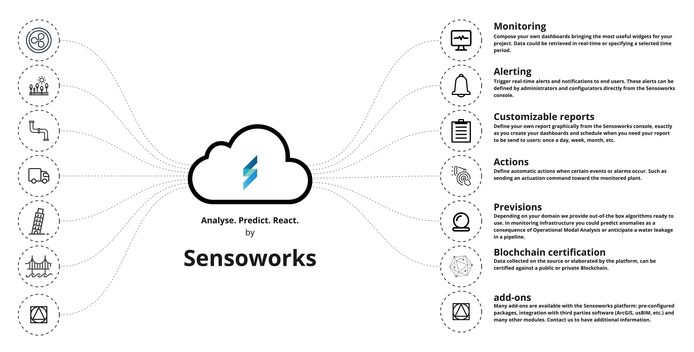

# Intro

<video width="640" height="480" controls>
  <source src="assets/video/sensoworks-intro.mp4" type="video/mp4">
</video>

Sensoworks is an extremely scalable IoT platform built mainly in Java (for the cloud platform) and Python (for the Edge components) and can be installed, depending on the customer's needs, on-premise, in the cloud or deployed in a hybrid environment.

It was designed from the start to be flexible and adaptive in collecting data from heterogeneous sources so that it can be used in different scenarios and in different fields of application.

A ready-to-use platform that can be integrated with any sensor and integrated with algorithms that enable predictive maintenance. Sensoworks specializes in infrastructure monitoring (bridges, dams, construction sites or more complex constructions), as well as Circular City services (Waste Management, Smart Mobility & Parking, Smart Building).

With its comprehensive capabilities and easy integration with other systems, Sensoworks is a versatile and reliable choice for IoT data management and analysis.

One of the key features of Sensoworks is its ability to collect data from a wide range of sources and sensors, devices, and other systems. This data is then processed and analyzed using advanced algorithms and machine learning techniques, allowing businesses to gain valuable insights and make informed decisions. The platform also offers a range of tools for visualizing and reporting on data, making it easy for users to understand and interpret the information. Additionally, Sensoworks is highly flexible and can be customized to meet the specific needs and requirements of each individual customer. With its scalability, adaptability, and powerful analytics capabilities, Sensoworks is a powerful tool for managing and maximizing the value of IoT data.

